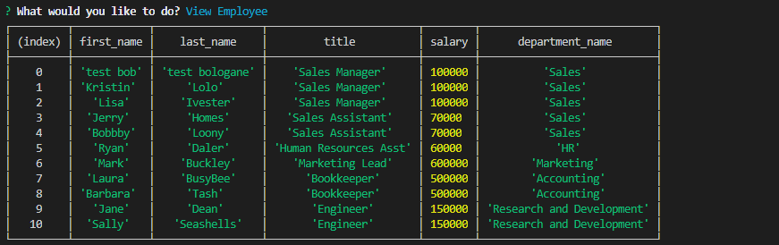
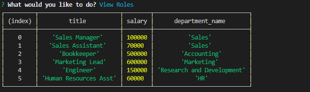
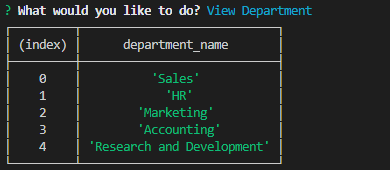

# Employee Tracker with Express
  
   ## Table of Contents: 
   
* [Description](#Description)

* [Installation](#Installation)

* [Usage](#Usage)

* [License](#License)

* [Contributors](#Contributors)

* [Tests](#Tests)

* [Questions](#Questions)

   ## Description: 
   Are you looking for an easy way to track your employees, job positions and departments? Look no further than this simple command line interface app that allows you track, create and update your employees, departments and positions! The SQL database is created with your answers to the prompts. Technologies used: Express, Inquirer, MYSQL, Node.js, JavaScript & npm.
   ## Installation: 

   Installation Instructions

   From your terminal: npm install , Login into mysql then use the following sequence: source employee_db.sql, source seeds.spl, quit . At this point you are ready to start to use our Employee Tracker with Express! Then: node employeetracker.js
   ## Usage: 

   Usage Information 

   After you run node employeetracker.js, follow the prompts to do what you need! 

    Sample Employee
    

    Sample Roles
    

     Sample Departments
    
  
    Video of Employee Tracker in Action!
    
    

   ## License
   
   
   ## Contributors: 

   Contribution Guidelines

   @janelle-deane
   ## Tests: 

   Test Instructions

   none
   ## Questions: 
   Feel free to reach out to me either on my github or email. 
   
   Github:
   https://github.com/janelle-deane/
   
   Email:
   janelle.m.deane@gmail.com